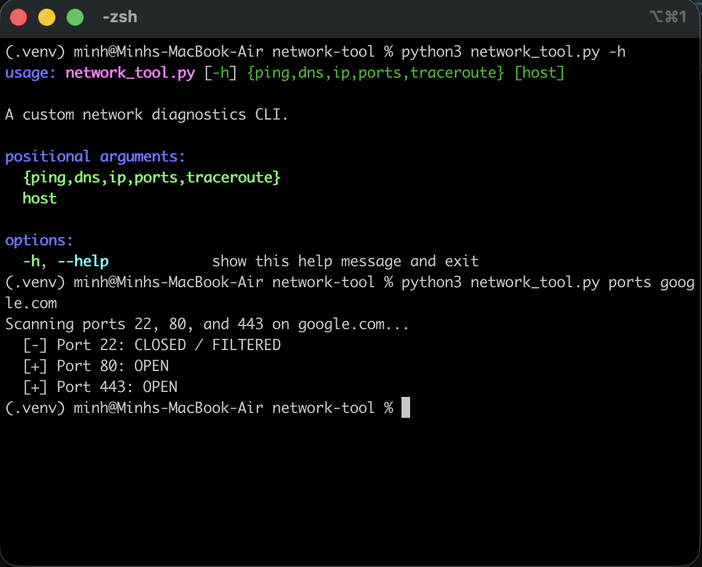

# python-projects

A collection of command-line Python scripts along with my learning notes.

> **Highlight:** The capstone of this repository is the `network-tool`, a modular CLI built with `argparse`, `subprocess`, and `socket` to run Layer 3 routing checks, DNS lookups, and raw TCP port scans directly from the terminal.



---

## 🚀 Featured Projects

| Project | Description | Key Concepts |
|---|---|---|
| **[Network Diagnostics CLI](./network-tool)** | A multi-tool command-line interface for network troubleshooting. | `argparse`, `subprocess`, TCP Sockets, ICMP, DNS |
| **[Raw TCP Echo Server/Client](./TCP-echo)** | A custom server and client communicating over the loopback interface. | `socket`, IPv4 (`AF_INET`), Blocking/Listening, Byte Encoding |
| **[Weather Forecast CLI](./weather-cli)** | A terminal dashboard parsing real-time data from chained APIs. | REST APIs, JSON Parsing, `try/except` Exception Handling |
| **[GitHub User Search](./github-search)** | A modular CLI querying the public GitHub REST API. | `requests`, Separation of Concerns, Error Handling |

---

## 🛠️ Foundational Utilities

Below are the foundational scripts built to master core Python concepts like file I/O, classes, dictionaries, and string manipulation:

* `library.py`: Object-oriented programming (OOP) and class structures.
* `todo_app.py`: File I/O and persistent state management using JSON.
* `journal_script.py`: Terminal text parsing and file writing.
* `unit_converter.py`, `calculator.py`, `bmi_calculator.py`: Core logic, math operators, and user input handling.

---

**Environment:** Built and tested on macOS/Unix.

## How to Run
* For scripts that use the **requests** library, please run these commands first in your own terminal:
**1. Navigate to your project directory:**
* Open your terminal and make sure you are inside your project folder.

**2. Create the virtual environment:**
```
python3 -m venv .venv
```

**3. Activate the environment:**
```
source .venv/bin/activate
```

**4. Install requests inside the venv**
```
pip install requests
```

**5. Run the Python script:**
* Run the code as instructed in its own folder. Please use **python3** instead of **python** if error occurs.

**6. Exit the venv:**
* When you're done with the script, use **deactivate** to exit the virtual environment.