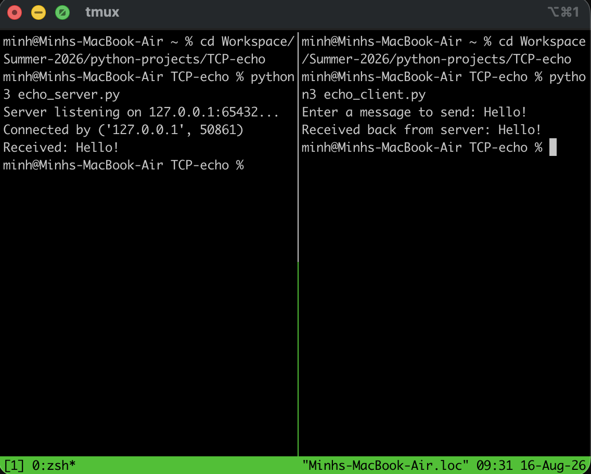

# Raw TCP Echo Server & Client

An implementation of a TCP server and client using Python's built-in `socket` module. This project demonstrates raw TCP, connection binding, blocking, and byte-encoding over the loopback interface (`localhost`).

## Demonstration


## Features
* **IPv4 & TCP:** Uses `socket.AF_INET` and `socket.SOCK_STREAM`.
* **Binding & Listening:** Server binds to `127.0.0.1:65432` and blocks while waiting for an `accept()` event.
* **Byte Encoding:** Transmits strings by encoding them into raw bytes, and decodes the response back to plaintext.

## How to Run

You will need two separate terminal windows.

**1. Start the Server:**
```bash
python3 echo_server.py
```

**2. Run the Client (in a new terminal):**
```bash
python3 echo_client.py
```