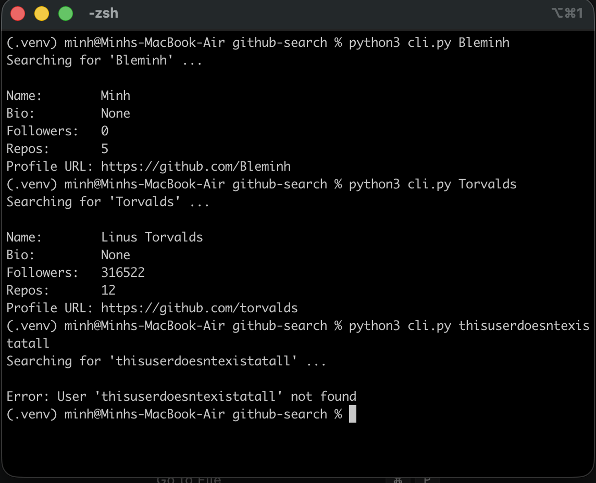

# GitHub User Search CLI

A modular Python command-line interface that interacts with the public GitHub REST API to fetch and display user profile data. 

## Demonstration


## Features
* **REST API Integration:** Uses the `requests` library to perform GET requests.
* **JSON Parsing:** Safely extracts specific data points (Name, Bio, Repos) from the JSON payload using default fallbacks.
* **Error Handling:** Gracefully catches 404 Not Found errors for invalid usernames.

## How to Run

```bash
# Navigate to the directory
cd github-search

# Run the CLI tool with a target username
python cli.py torvalds