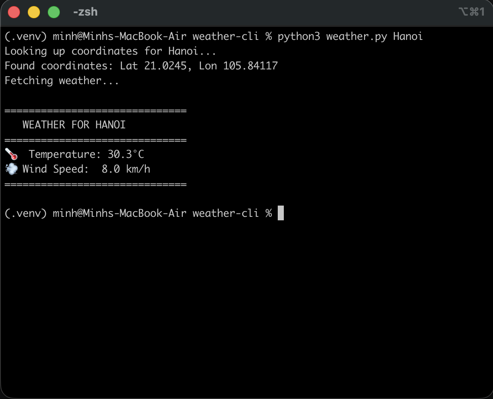

# Weather CLI

A Python command-line tool that performs chained REST API requests to the Open-Meteo free API to fetch and display real-time weather data for any city.

## Demonstration


## Features
* **Chained API Requests:** First hits the Geocoding API to convert a city name into latitude/longitude, then passes those coordinates to the Forecast API.
* **Robust Error Handling:** Uses `try/except` blocks to gracefully catch and report network timeouts (`requests.exceptions.RequestException`) and invalid city inputs (`KeyError`).
* **Clean UI:** Formats the raw JSON payload into an easily readable terminal dashboard.

## How to Run

```bash
# Navigate to the directory
cd weather-cli

# Run the CLI tool with a target city
python weather_cli.py "London"